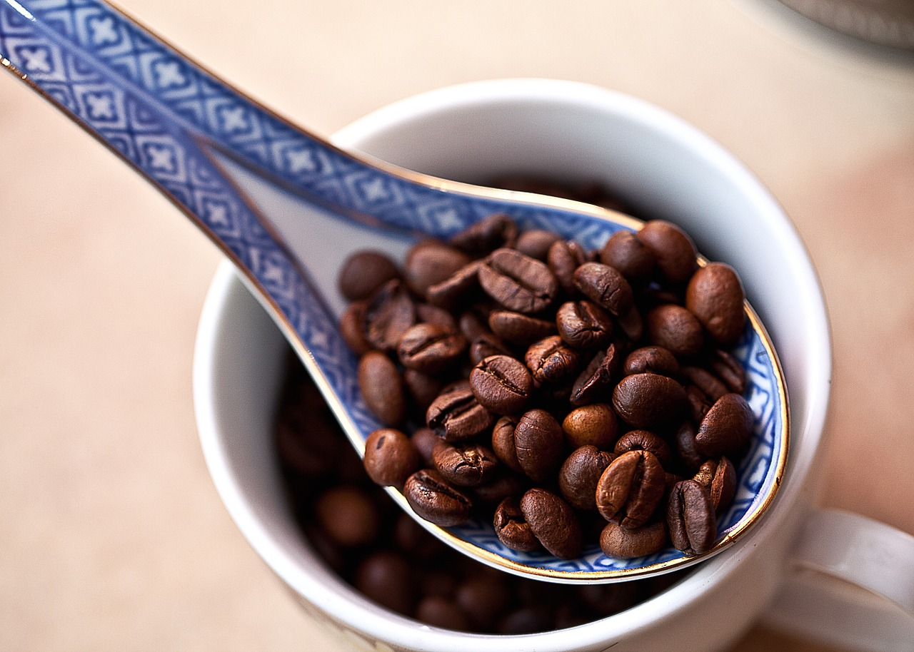

**ARABIKA**

Nazwa kawy pochodzi od terenów, na których została zapoczątkowana uprawa tej odmiany, czyli od południowej Arabii. Ziarna kawy są długie i płaskie. Na jednej stronie mają "wcięcie" w kształcie litery "S". Kawowce Arabiki są dość niesforne w uprawie, a temperatura na plantacji nie powinna przekraczać 30 stopni C. Drzewa mają również wymagania dotyczące wilgotności i są mało odporne na szkodniki, zwłaszcza niektóre ich odmiany.

**ROBUSTA**

Robusta jest łatwiejsza w uprawie od Arabiki oraz odporniejsza na warunki atmosferyczne i choroby. Jej ziarna są niewielkie i delikatnie zielone. Na jednej stronie posiadają charakterystyczne, biegnące wzdłuż "wcięcie".

**ARABIKA VS. ROBUSTA**

Jedną z ważniejszych różnic pomiędzy tymi gatunkami kawy jest zawartość kofeiny. Arabika posiada jej mniejszą ilość, dzięki czemu jest mniej gorzka i delikatniejsza w smaku. Zawartość kofeiny w Arabice wynosi 0,9-1,5%, podczas gdy w Robuście - 1,9-4%. Rozkoszując się Arabiką poczujemy lekko kwaskowaty, czekoladowy lub owocowy posmak. Natomiast w Robuście na pewno da się wyczuj jej ostry i wyrazisty posmak. Robusta ze względy na mniejsze wymagania uprawy jest określana gorszym gatunkiem kawy i najczęściej używana jest do produkcji kawy rozpuszczalnej.

**KTÓRY GATUNEK KAWY WYBRAĆ?**

Ze względu na walory smakowe Arabikę uważa się za kawę "tą lepszą". Jednakże to naprawdę zależy od rodzaju zaparzenia kawy oraz indywidualnych preferencji każdego z nas. Jeśli chcecie rozkoszować się przyjemną w smaku, dobrą kawą, zdecydowanie polecamy Arabikę. Natomiast w przypadku, gdy potrzebujemy solidnej dawki kofeiny na pobudzenie, dobrego kopa da filiżanka Robusty.

**\#KAWAKTORAPOMAGA**

Nasza **Kawa, która pomaga** *([kupisz tu](https://numine.pl/shop/))* to pyszna Arabika - odmiana Bourbon Mayaguez, którą selekcjonujemy specjalnie dla Was, aby uzyskać jakość premium. Kawa w postaci zielonych ziaren z Rwandy trafia do Polski, gdzie jest świeżo palona w zaprzyjaźnionej palarni i pakowana w specjalne opakowanie z wentylem , dzięki czemu zachowuje wyjątkową świeżość oraz aromat ziaren.

