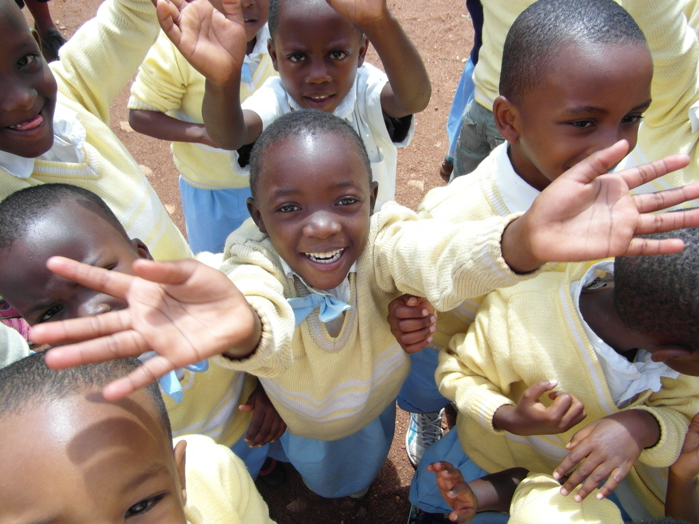
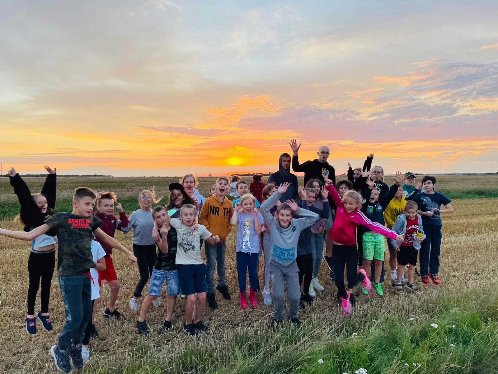
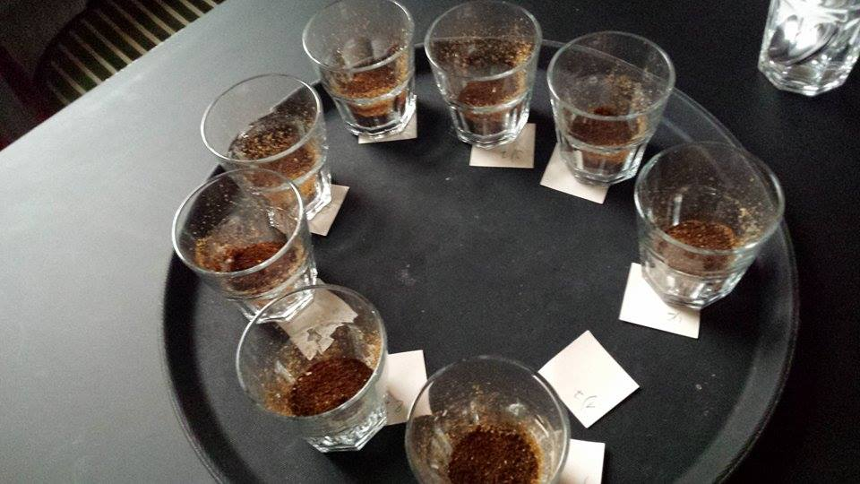
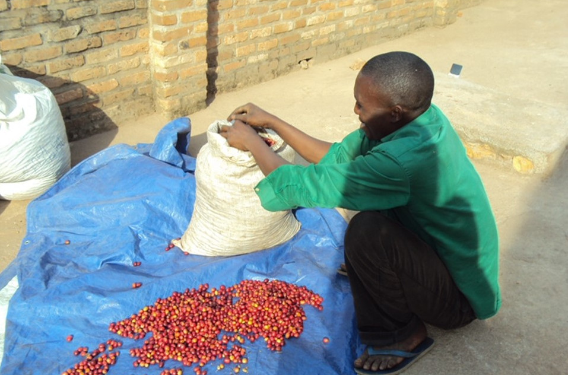

## 1. Organizacja i finansowanie letnich obozów edukacyjnych dla dzieci i młodzieży z pieczy zastępczej.
Od przeszło 10 lat jako fundatorzy, od 2020 już jako fundacja organizujemy wartościowe obozy
integracyjne dla dzieci i młodzieży . Obozy mają różne profile zainteresowań: jeździecki, artystyczny,
survivalowy, wokalny i biorą w nich udział zarówno dzieci ze zwykłych domów, jak i dzieci z domów
dziecka.

pragniemy, aby wszystkie dzieci miały równy dostęp do wartościowego wakacyjnego wypoczynku.

<b>
DOCHÓD ZE SPRZEDAŻY NASZYCH OBOZÓW JEST PRZEZNACZONY NA SFINANSOWANIE KOSZTÓW
WYPOCZYNKU DLA NASZYCH PODOPIECZNYCH , A TAKŻE REALIZACJĘ POZOSTAŁYCH CELÓW
POMOCOWYCH, KTÓRE WYZNACZYŁA SOBIE FUNDACJA „NIL SINE NUMINE”.
</b>

*Organizowane przez nas obozydzieciece są oparte na fundamencie wartości uniwersalnych tj.:*

*Miłość - Odpowiedzialność – Praca – Obowiązek*

**Miłość**: podczas turnusu swoim przykładem staramy się przekazać dzieciom czym jest wzajemny szacunek i troska o drugiego człowieka, koleżankę czy kolegę, panią w kuchni, wychowawcę. Uczymy dzieci miłości i troski o zwierzęta, która nie polega tylko na zabawie czy głaskaniu, lecz rodzi obowiązek jak mówił Mały Książę:

> „jesteś odpowiedzialny za to co oswoiłeś” 

Dlatego uczymy jak być wiernym w przyjaźni i miłości.

**Odpowiedzialność**: rozmawiamy z dziećmi czym jest odpowiedzialność i pokazujemy im na przykładach z życia jak ja praktykować. Misją naszej fundacji jest 

> „Odpowiedzialnie służyć ludziom i uczyć ludzi bycia odpowiedzialnymi za swój los.”`

dzieci są odpowiedzialne za karmienie zwierząt oraz wzajemnie siebie nawzajem. 

**Praca**: wspólnie pracujemy w stajni przy karmieniu i czyszczeniu koni, w kuchni pomagając serwować posiłki i sprzątać naczynia, w domu sprzątając po sobie, ścieląc rano swoje łóżka i wyrzucając śmieci. Uczymy dzieci jak wykonywać pracę z radością poprzez np. :”kreatywne sprzątanie”.

**Obowiązek**: dzieci podczas turnusów mają swoje wachty tj. w harcerstwie: dyżur kuchenny czy sprzątanie albo przy karmieniu zwierząt. Całość nadzorują wychowawcy. Taki program uczy dzieci czym jest obowiązek oraz jakie są konsekwencje z niewykonania go. Są to także turnusy integracyjne, w których często biorą udział dzieci z domów dziecka, czy też dzieci przebywające w rodzinach zastępczych. Najczęściej dzieci z tradycyjnych rodzin nie uzmysławiają sobie jak ogromnym szczęściem jest posiadanie pełnej rodziny, kochających rodziców. Udział w turnusach z wychowankami domów dziecka pokazuje im to, co mają w życiu najcenniejsze : kochająca rodzina. 

Program zajęć : 
* wspólne aktywności
* zajęcia sportowe 
* zajęcia artystyczne wzmacniające poczucie wartości

Obozy odbywają się w obiekcie turystycznym, którym zarządza fundacja: **[www.noclegitykocin.pl](https://www.noclegitykocin.pl)**
Zapisu na obóz można dokonać przez naszą stronę: **[www.obozydziciece.pl](https://www.obozydziciece.pl).**

## 2. NASZA KAWA - CEGIEŁKA #KAWAKTORAPOMAGA
Na niewielkiej plantacji w Rwandzie w Save, gdzie w 1900 roku misjonarze - Ojcowie Biali założyli pierwszą misję i zbudowali pierwszy kościół katolicki, rośnie pyszna kawa arabika odmiana Bourbon Mayaguez, która selekcjonujemy dla was aby uzyskać jakość premium. Kawa w postaci zielonych ziaren trafia do Polski, gdzie jest świeżo palona w zaprzyjaźnionej palarni i pakowana specjalnie dla was w opakowanie z wentylem, aby zachować wyjątkową świeżość i aromat ziaren. Na plantacjach w Rwandzie pracuje najbiedniejsza ludność wiejska. Ze swoich dochodów utrzymują wielodzietnie rodziny. Kawa daje więc także pracę najuboższym w Rwandzie. Kawę z misją #kawaktorapomaga możecie zakupić na tej stronie w zakładce „sklep”.

Producent/Rwanda, Dystrybutor /Polska FUNDACJA NIL SINE NUMINE

* Postać kawy: palona pełnoziarnista, ziarno selekcjonowane
* Rodzaj kawy: 100% Arabica
* Gatunek kawy: BOURBON MAYAGUEZ*
* Obróbka kawy: washed ( mokra/myta)
* Kraj pochodzenia kawy: Rwanda
* Wysokość upraw: powyżej 1500m n.p.m.
* Profil palenia kawy: optymalny
* Smak kawy: gładki, przyjemny otulający podniebienie
* Nuty smakowe**: nuty cytryny, po przestygnięciu wiśnia i suszone owoce, żurawina
* Aromat kawy: intensywny, orzeźwiający lekko słodki
* Gęstość kawy: optymalna dla espresso, optymalna pod filtr
* Waga kawy: opakowanie z wentylem 250g.
* Palenie do : filtr, espresso
* Rozmiar ziarna: 16,5

<small>
* Bourbon to wykwintna odmiana arabiki, która wywodzi się z wyspy Reunion, niegdyś nazywanej Bourbon, położonej u wybrzeży Afryki na Oceanie Indyjskim. Najlepiej radzi sobie na wysokościach od 1100 do 2000 m n.p.m. W porównaniu do odmiany Typica, posiada większe liście i bardziej zaokrąglone owoce w kolorach żółtym i czerwonym. Jej niewielkie, a zwarte owoce dojrzewają dość szybko i z łatwością opadają pod wpływem silnego wiatru lub deszczu. Ziarno daje kawę o dużej gęstości. Mayaguez jest wersją Bourbon która pochodzi z Rwandy.  
** filtr
</small>

## 3. UTRZYMANIE KOOPERATYWY PRACOWNICZEJ W RWANDZIE
Kooperatywa składa się z osób najbiedniejszych, głównie kobiet posiadających co najmniej kilkoro
dzieci. Koszt utrzymania 1 osoby wynosi około 50-60 $ miesięcznie. Kobiety pracują na plantacji
kawy, uprawach ryżu, a także przy innych pracach głownie rolniczych.

