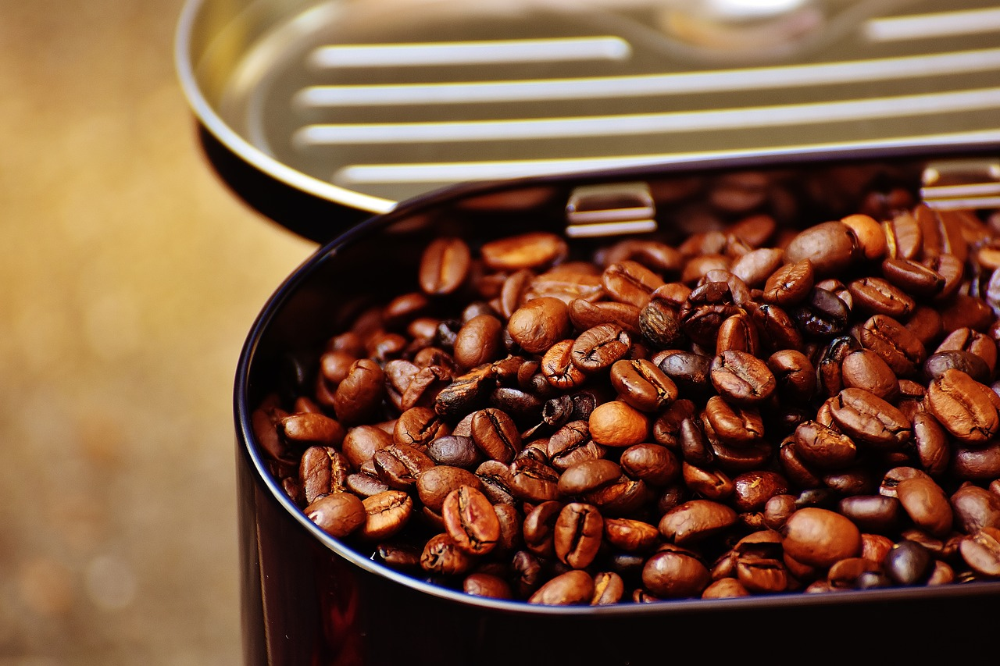

**W czym przechowywać kawę?**

Większość osób zakupioną kawę przesypuje do pojemnika, a tak naprawdę warto zaufać jej oryginalnym opakowaniom. Są one bowiem wykonane z trwałych materiałów, które nie przepuszczają powietrza i chronią ziarna przed wszelkimi czynnikami destrukcyjnymi. Po otwarciu paczki, górną krawędź należy zwinąć pozbywając się nadmiaru powietrza i spiąć klipsem. To naprawdę wystarczy! Pojemniki szklane nie uchronią kawy przed niekorzystnym działaniem światła, a metalowe puszki mogą wpłynąć na smak ziarenek. Dlatego też zaufajmy oryginalnym torebkom, w które kawę pakuje producent!

**Gdzie przechowywać kawę?**

Kto z Was słyszał o przechowywaniu kawy w lodówce? Podobno w ten sposób przechowywana będzie cieszyć się dłuższą datą przydatności. Nic bardziej mylnego! W ten sposób co najwyżej może przyciągnąć wilgoć i wszelkie zapachy z żywności. Kawa jest naturalnym pochłaniaczem wilgoci, więc z pewnością nikt z Was nie chce rozkoszować się nieświeżym napojem z posmakiem kiełbasy lub sera pleśniowego, prawda?

Kawa powinna być przechowywana w suchym, chłodnym i zaciemnionym miejscu!

**Czy można mielić kawę na zapas?**

Pamiętajmy, że najlepiej smakuje kawa bezpośrednio, świeżo zmielona tuż przez parzeniem. To nie zajmuje dużo czasu, a sprawi, że kawa będzie smakowała o wiele lepiej.

**Czy termin ważności kawy ma znaczenie?**

Oczywiście, że tak! Kawa z biegiem czasu wietrzeje, a to oznacza utratę jej smaku i aromatu. Najlepiej smakuje kawa świeżo palona. Jeśli kupujemy kawę warto ją spożyć do około 4 tygodni od momentu otwarcia opakowania.

To tylko najważniejsze zasady dotyczące prawidłowego przechowywania kawy. Stosując je na pewno Wasza kawa dłużej będzie smakowała jak podczas pierwszych dni od zakupu.

