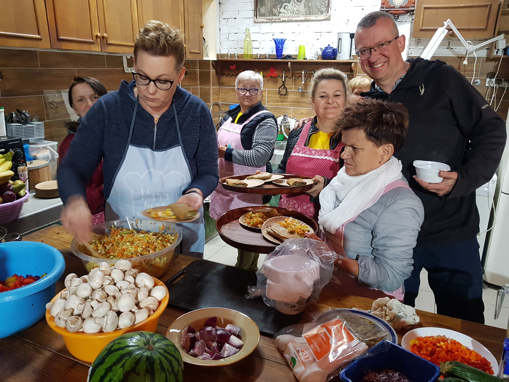
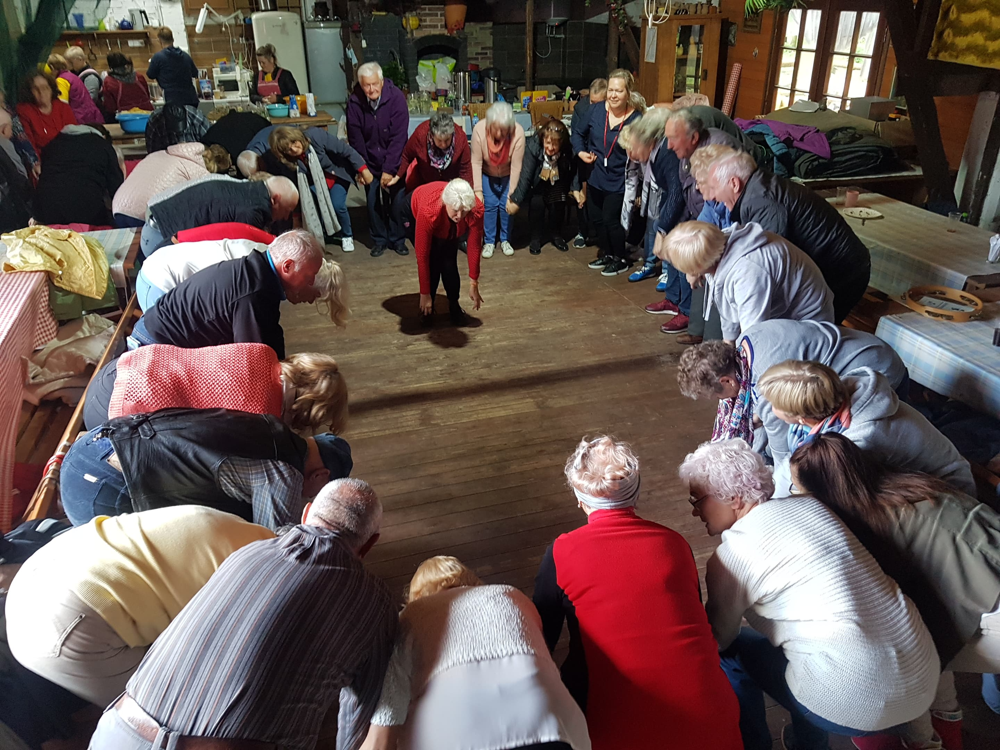
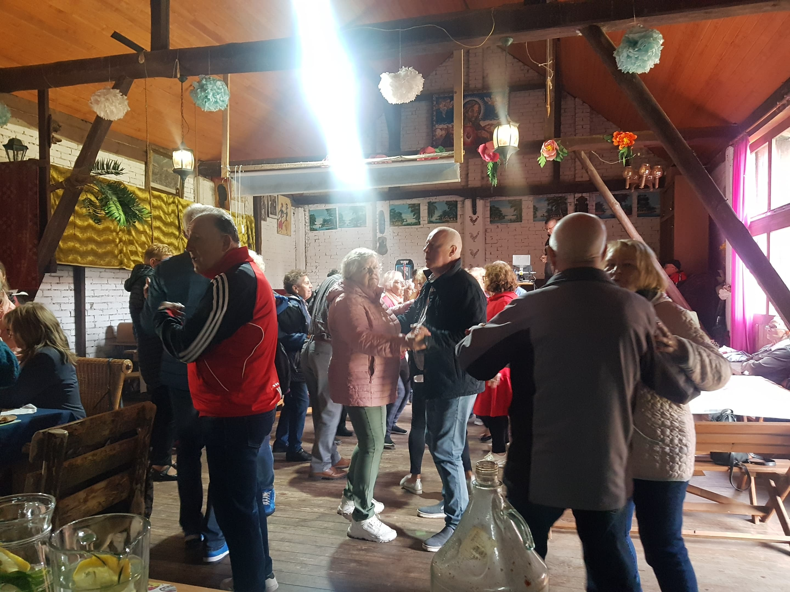
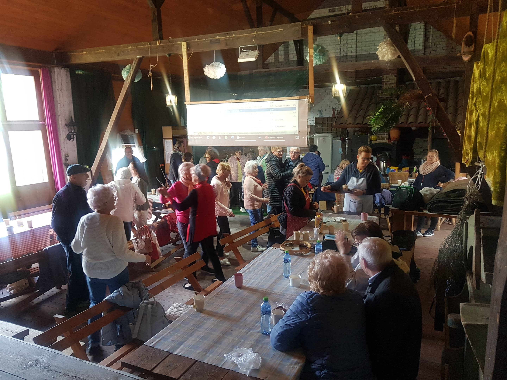
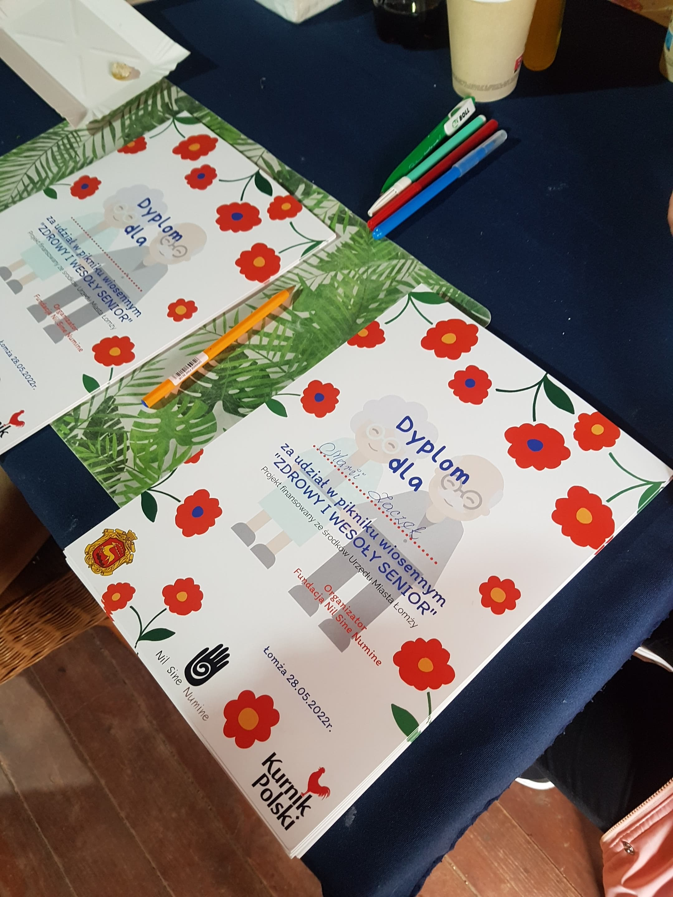

<!--StartFragment-->

Dziś w gospodarstwie agroturystycznym Kurnik Polski pomimo pogody było szczególnie wesoło. Dzięki pomocy finansowej Urzędu Miasta Łomży fundacja Nil Sine Numine zorganizowała Piknik Wiosenny "Zdrowy i wesoły senior". Nasi goście pokazali, że w każdym wieku można dobrze się bawić! Oprócz tańców uczestnicy mogli wziąć udział w wykładach na temat ruchu i diety, warsztatach kulinarnych, tańców etnicznych oraz w warsztatach na temat kinezjologii. Było też tłoczenie oleju, wspólny posiłek i czas na kawę #kawaktorapomaga! Seniorzy się wytańczyli, dowiedzieli wielu rzeczy na temat zdrowia i szczęśliwi wrócili do swojego miejsca zamieszkania. Dzień okazał się niezwykle udany!

<!--EndFragment-->

