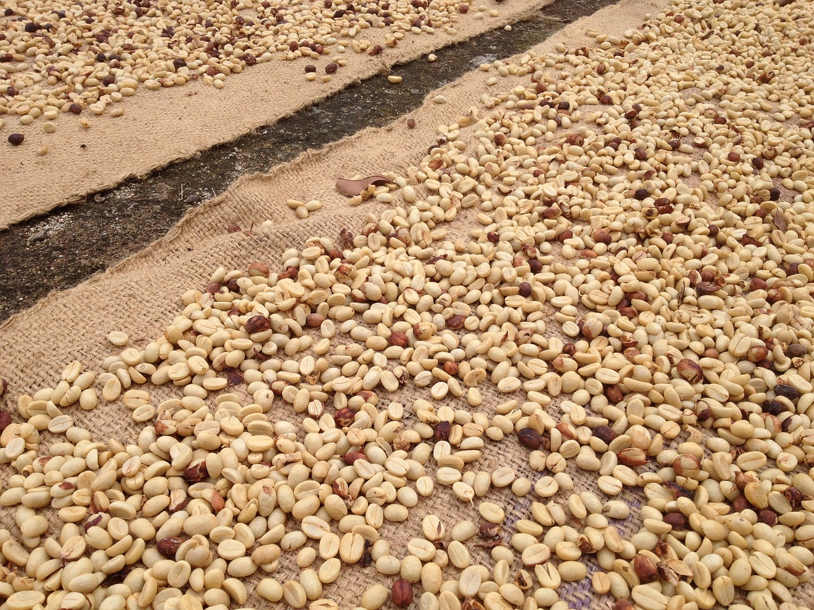

<!--StartFragment-->

**Jak przetwarzana jest kawa i jakie są rodzaje procesów?**

Ponieważ nasiona kawy (powszechnie określane jako „fasola”) znajdują się w owocach rosnących na drzewach, istnieje wiele etapów, zanim dotrzemy do rzeczywistego ziarna kawy, które palimy, mielimy, parzymy i pijemy. Po zebraniu owoców z drzew kawowych, wiśnie muszą być przetworzone, aby usunąć skórę i miazgę z nasion. Żeby to zrobić, istnieją dwa główne procesy: mycia i naturalnego suszenia.

**Naturalny proces suszenia**\
\
Naturalny proces suszenia kawy na słońcu to metoda najstarsza. Odnosi się do tej samej metody przetwarzania, która zazwyczaj obejmuje suszenie wiśni kawowych na specjalnych, podniesionych łóżkach bezpośrednio na słońcu. Aby zapobiec zepsuciu się wiśni, są one grabione i obracane przez cały dzień, a następnie przykryte w nocy lub podczas deszczu. Ten proces, który może trwać od 3 do 6 tygodni jest najbardziej tradycyjną metodą przetwarzania kawy. Proces suszenia czereśni na słońcu zrodził się w miejscach, w których nie ma niezawodnego dostępu do wody i zazwyczaj działa najlepiej na obszarach o niskiej wilgotności oraz rzadkich opadach deszczu - takich jak części Etiopii i Jemenu, chociaż niektórzy rolnicy wykorzystują naturalny proces w innych miejscach z uwagi na tradycję. Po  wysuszeniu czereśni do optymalnego poziomu są one wysyłane do młynów, aby oddzielić nasiona od reszty suszonych owoców. Proces ten zwany jest „łuszczeniem”.\
\
**Proces mycia**\
\
Drugi proces to proces mycia lub mokry. W tej metodzie wiśnie są usuwane z nasion przed procesem suszenia. Aby to zrobić, wiśnie najpierw się sortuje, aby zapewnić im stały poziom dojrzałości, a następnie przepuszcza przez depultery - maszyny, które ściskają wiśnie, aż nasiona wyskoczą. Nasiona i skórki są rozdzielane, po czym nasiona przenoszą się do zbiorników, w których przechodzą proces fermentacji i mycia lub mokry proces wspomagany maszynowo, aby usunąć resztę śluzu. Pozostałe owoce - do czyszczenia nasion przed są suszone. W procesie fermentacji i przemywania pozostały śluz jest rozkładany przez mikroby oraz drożdże, a następnie jest ponownie przemywany wodą w celu usunięcia śluzu z nasion. W procesie wspomaganym maszynowo wiśnie są mechanicznie szorowane, a większość śluzu widzialnego jest usuwana przez tarcie. Po umyciu nasion suszy się je na słońcu na tarasach, podwyższonych łóżkach lub w maszynach.\
**\
W jaki sposób te różne procesy dają różne smaki kawy?**\
\
Ponieważ nasiona naturalnej przetworzonej kawy suszonej są dłużej zamknięte w wiśni, powstałe w wyniku tego procesu smaki są na ogół bardziej owocowe i pełniejsze. Naturalne cukry w nasionach i wokół nich są „wlewane” do niej podczas tego procesu i skutkują wyższą zawartością cukru niż kawy myte. Z drugiej strony myte kawy powodują, że smaki są bardziej związane z samą fasolą niż z miąższem i skórą.\
Metody obróbki kawy mają zasadniczy wpływ na ostateczny jej smak. Najłatwiej dostrzec różnice metod obróbki przy parzeniu metodami alternatywnymi w dripie bądź chemeksie i aeropressie.\
\
Źródło: <https://counterculturecoffee.com/blog/coffee-basics-natural-sundried-vs-washed-processes>

<!--EndFragment-->

<!--EndFragment-->

