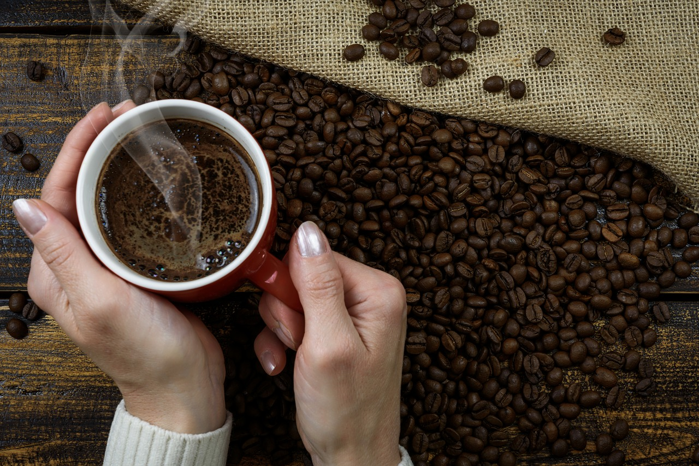

**Profil sensoryczny** to cechy, na podstawie których można ocenić smak i jakość kawy.

Zaliczmy do nich:

* czystość naparu (brak innych aromatów oprócz kawowych, np. pleśni, opakowania, innych produktów)
* aromat
* poziom kwasowości (podstawowa cecha najczęściej utożsamiana z winnością i posmakami owoców)
* poziom słodyczy
* wyrazistość smaku i posmak
* body (fizyczne odczucie napoju, które zostaje na języku, tzn. konsystencja i gęstość)
* balans (spójność smaku bez dominacji mocy, słodkości, goryczy i kwaskowatego smaku)

**Czynniki, które mają wpływ na profil sensoryczny:**

* pochodzenie ziarna
* uprawa, zbiór i przechowywanie
* obróbka i selekcja ziaren
* stopień wypalenia kawy
* świeżość
* przygotowanie kawy (np. zmielenie lub nawet używa woda)
* rodzaj przygotowania (kawiarka, ekspres, drip itp.)

Jakość i smak kawy nie zależy przede wszystkim od jej pochodzenia, czyli miejsca, w którym sobie spokojnie dojrzewała. Dużą rolę odgrywa temperatura, wilgotność, opady oraz skład mineralny gleby, lecz pozostałe czynniki są również istotne i wpływające na finalny smak oraz jakość ziaren.

*A jaką kawę Wy lubicie? Gładką, delikatnie owocową, o mniejszej, czy większej kwasowości?*

Koniecznie też zerknijcie na naszą >> **[\#kawaktorapomaga](https://numine.pl/shop/)**! To kawa rzemieślnicza, starannie wyselekcjonowana w jakości premium pochodząca z naszej własnej plantacji w Rwandzie (Afryka). Ziarenka dojrzewają bez pośpiechu na wulkanicznych wzgórzach Rwandy w podrównikowym słońcu.

Pamiętajciem że **wraz z zakupem #kawaktorapomaga wspieracie projekty Fundacji „Nil Sine Numine”**, której działalność statutowa opiera się na organizacji wartościowego wypoczynku połączonego z edukacją dla dzieci z pieczy zastępczej, dzieci niepełnosprawnych i dzieci z najuboższych rodzin [www.obozydzieciece.pl](https://www.blogger.com/#), a także wspieraniu kooperatywy pracowniczej złożonej z najbiedniejszej ludności w Rwandzie.

