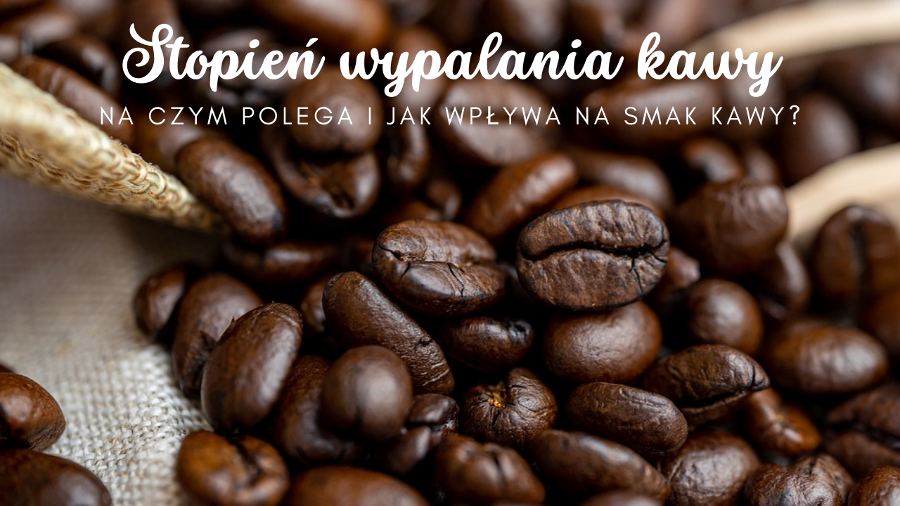

<!--StartFragment-->

**Stopień wypalania kawy - co to takiego?**

W skrócie stopień wypalania kawy ogromnie wpływa zarówno na jej smak, jak też zapach i zawartość kofeiny w ziarnach. To jeden z bardzo ważnych etapów obróbki kawy, którym powinni zajmować się wyłącznie specjaliści i powinien być on dostosowany do gatunku tych magicznych ziarenek. Uprzednio odpowiednio przygotowane ziarna trafiają do specjalnych pieców i tam poddaje się je działaniu wysokiej temperatury. Następnie ziarna się chłodzi na specjalnie do tego przystosowanych tacach.

**Stopień wypalania kawy - rodzaje**

Stopnie palenia kawy zależą od czasu przebywania kawy w piecu. Im więcej ziarna tam znajdują się, tym bardziej posiadają głębszy smak z czekoladowo-orzechowym aromatem. Napar z tak palonej kawy najzwyczajniej jest mocniejszy. Kawa krócej palona jest kwaskowata w smaku oraz posiada więcej kofeiny.

***\* Kawa jasno palona -*** delikatnie brązowe ziarna charakteryzują się najbardziej kwaskowatym smakiem z wyczuwalnymi nutami cytrusowymi. Taka kawa posiada największą zawartość kofeiny.

***\* Kawa średnio palona -*** ziarna są nieco bardziej brązowe od poprzedniego rodzaju palenia i cechują się bardziej zbilansowanym smakiem. Oznacza to, że kawa nie jest za bardzo kwaśny lub też gorzka. Nie znajdziemy już w niej tych wyczuwalnych cytrusowych nut. Zawartość kofeiny w naparze również jest wypośrodkowana pod względem pozostałych rodzajów wypalania ziaren. Jednym słowem jest optymalna.

***\* Kawa ciemno palona -*** ziarna kawy po takim paleniu posiadają ciemną barwę o intensywnych zapachu oraz stosunkowo niskiej zawartości kofeiny. Rozkoszując się naparem wyczujemy nuty gorzkiej czekolady.

**Stopień wypalania kawy - podstawowe różnice**

\* Smak -kawa jaśniej palona jest bardziej słodsza i posiada wyższą kwasowość, kawa ciemniej palona charakteryzuje się większą goryczą.

\* W ziarnach jasno palonych zawarte w nich cukry są skarmelizowane, a w ciemno palonych po prostu spalane.

\* Jasno palona kawa cechuje się naturalnymi aromatami, czyli owocowymi, przyjemnie czekoladowymi, orzechowymi oraz kwiatowymi.

\* Czym kawa jest jaśniej palona, tym posiada więcej kofeiny.

**Stopień wypalania kawy - który najlepszy?**

Z gustami i preferencjami nie dyskutuje się, więc każdy powinien zdecydować indywidualnie jaką kawę woli. Jeśli chcecie spróbować naszej gładkiej i przyjemnie otulającej podniebienie kawy, to zapraszamy do sklepu >> **[tu](https://numine.pl/shop/)** lub do wsparcia zbiórki >> **[tu](https://zrzutka.pl/vb6bau)**. #KAWAKTORAPOMAGA charakteryzuje się następującymi nutami smakowymi: lekko cytrynowe, po przestygnięciu wyczuwalna wiśnia i suszone owoce, w tym żurawina. Aromat naszych ziaren jest intensywny, orzeźwiający oraz lekko słodki. Smacznego! A jaką kawę Wy pijecie?

<!--EndFragment-->

