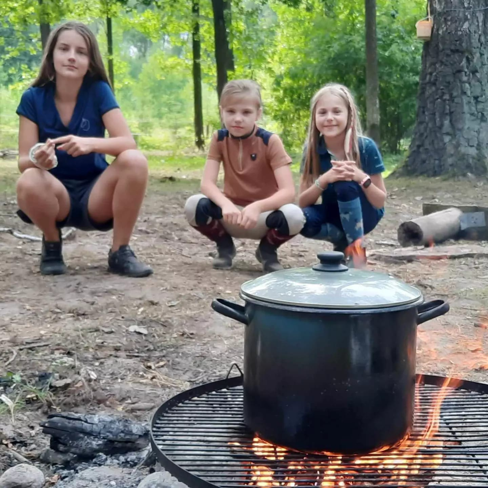

Realizujemy właśnie program pt. : "Zaczyn Nowego Życia" obóz dla dzieci i młodzieży z rodzin dysfunkcyjnych . Program zaplanowano dla łącznie dla 18 dzieci, w tym 5 dzieci z Bielska Podlaskiego w wieku w wieku szkolnym 7-16 lat. Celem realizacji przedsięwzięcia jest  przeciwdziałanie uzależnieniom i zapobieganie patologiom społecznym , szczególnie w ramach  profilaktyki alkoholowej wśród dzieci i młodzieży z środowisk, rodzin dysfunkcyjnych  poprzez realizację programu  w formie przemyślanego programu obozu wakacyjnego. 
W programie zaplanowano :

1. zajęcia hipoterapeutyczne w stajni i na koniu 
2. warsztaty przedsiębiorczości,   : 
3. warsztaty psychologiczne,  
4. zajęcia rekreacyjne  oraz relaksujące 

Program dofinansował Urząd Miasta Bielsk Podlaski w kwocie 5000 zł. Dziękujemy!

